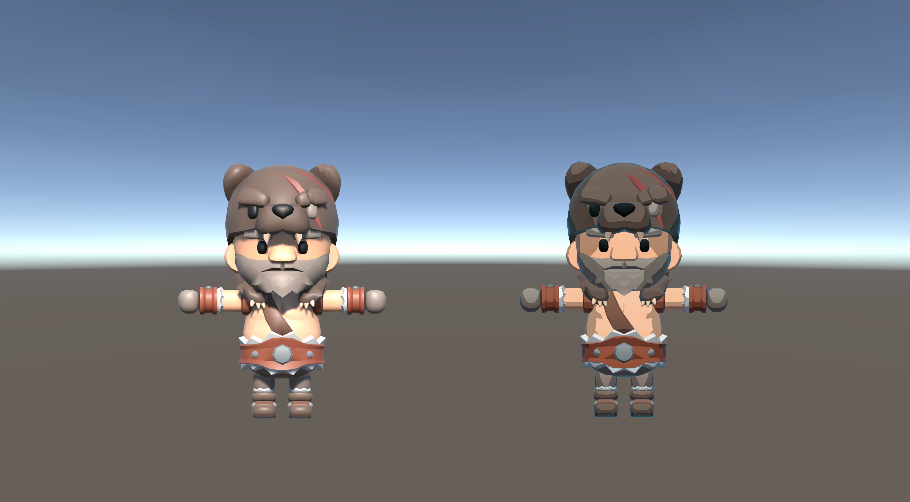

# Toon Shader (Unity URP)

A simple toon shader written in HLSL for Unity's Universal Render Pipeline. I built this while learning shader programming and experimenting with cel shading and rim lighting.

## Results



Left: Unity URP Lit | Right: Custom Toon Shader

## Implementation

The shader uses the main directional light to calculate diffuse lighting with `dot(N, L)`. Two thresholds divide the lighting into three bands, with separate colors for shadows, midtones, and highlights.

```hlsl
float shadowStep = step(_MidThreshold, NdotL);
float lightStep = step(_LightThreshold, NdotL);

float3 toonColor = lerp(_ShadowColor.rgb, _MidColor.rgb, shadowStep);
toonColor = lerp(toonColor, _LightColor.rgb, lightStep);
```

I also added view-dependent rim lighting using `dot(N, V)`:

```hlsl
float rim = pow(1.0 - NdotV, _RimPower);
```

The material supports a base texture, color tinting, and adjustable lighting thresholds, colors, and rim settings through the Unity Inspector.

## Files

- `MyLit.shader` — ShaderLab properties and URP pass setup
- `MyLitForwardLitPass.hlsl` — Vertex and fragment shader implementation
- `ToonShadingTestScene.unity` — Test scene

Shader files are located in `Assets/Shaders/MyLit/`.

## References

- [Ned Makes Games](https://www.youtube.com/@NedMakesGames) — Unity URP shader tutorials
- [KayKit](https://kaylousberg.itch.io/) by Kay Lousberg — Barbarian model and texture (CC0)

Built with Unity URP and HLSL.